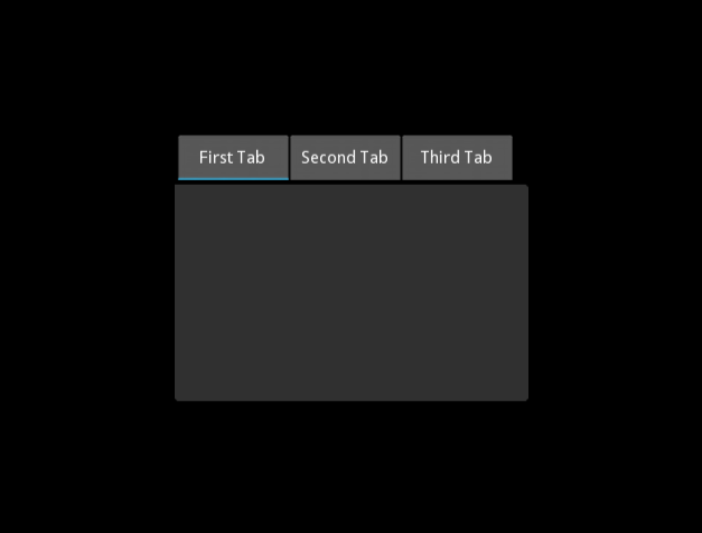

## Tab 윈도우 구현하기

참고: [Kivy 도큐먼트 예제](http://kivy.org/docs/api-kivy.uix.tabbedpanel.html)



주의: `do_default_tab: False` 으로 기본탭 생성을 막아준다.

```
'''
TabbedPanel
============

Test of the widget TabbedPanel.
'''

from kivy.app import App
from kivy.uix.tabbedpanel import TabbedPanel
from kivy.uix.floatlayout import FloatLayout
from kivy.lang import Builder

Builder.load_string("""

<Test>:
    size_hint: .5, .5
    pos_hint: {'center_x': .5, 'center_y': .5}
    do_default_tab: False

    TabbedPanelItem:
        text: 'First Tab'
    TabbedPanelItem:
        text: 'Second Tab'
    TabbedPanelItem:
        text: 'Second Tab'
""")


class Test(TabbedPanel):
    pass


class TabbedPanelApp(App):
    def build(self):
        return Test()

if __name__ == '__main__':
    TabbedPanelApp().run()
```

